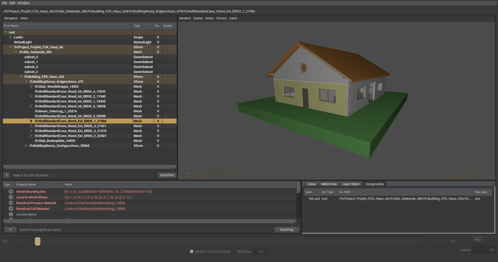
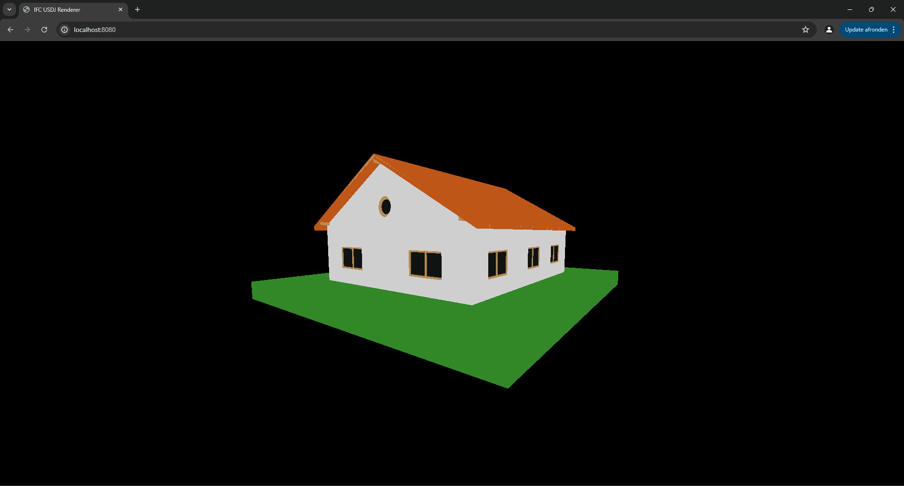

## IFC USDJ

NOTE: This is a personal endeavour and not related to officially related to either IFC or USD. This work does not have any official status in any form whatsoever.

The Industry Foundation Classes (IFC) is an open standard for the exchange of Building Information Modeling (BIM) data. It inherits ancient (but powerfull) serialization and schema tech from the STEP family of standards and is therefore hindered by monolithic exchanges, which means data transfers cannot be of an incremental or additive nature.

The Universal Scene Description (USD) presents an interesting approach for composing datasets, which addresses numerous workflow challenges in the AEC industry. Although its serialization is idiosyncratic, USD includes an efficient binary format. USD is more of a software platform than a neutral standard.

In order to assess the feasability of the USD composition workflow as a successor for STEP as the main serialization family for IFC, this repository explores several initiatives:

- An IFC to USD mapping (implemented in IfcOpenShell) that utilizes a minimal set of constructs from USD.
- A JSON serialization for USD (`.usdj` for lack of a better name) currently implemented as a very limited transformation in python.
- A barebones implementation of visualising `.usdj` files in JavaScript. Currently also able to overlay multiple layers.

Both the .usda to json transformer (python) as well as the visualizer (JavaScript) are about 100 lines of code. This highlights the drastic reduction of complexity compared to the current IFC serialization usage. Both are of course very limited in functionality and only applicable to a tiny subset of USD features.

*AC20-FZK-Haus.ifc haus converted to USD and visualized in UDSView*

*USD converted to JSON and visualized online in 100 lines of JavaScript code using ThreeJS*
